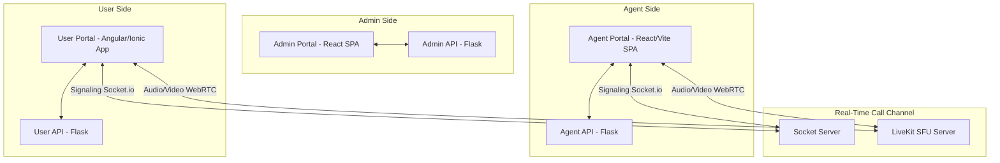

# KwikID Developer Onboarding Guide

Welcome to the **KwikID** team! This guide will help you understand what the platform is, how its different services fit together, and how to get started working on the codebase.

---

## 1. What is KwikID?

**KwikID** is a **Video KYC (VKYC - Video Know Your Customer)** platform. It allows businesses (like banks, fintechs, or insurance companies) to verify the identity of their customers through a live video call. 

During a call:
1. The **User** (customer) goes through steps like verifying their location, showing their ID card (PAN/Aadhaar) to the camera, and taking a selfie.
2. The **Agent** (verifier) guides the customer, checks the quality of the documents and selfie, and decides if the verification passes or fails.
3. The **Admin** (coordinator) manages the agent accounts, monitors call logs, and reviews video transcripts.

---

## 2. System Architecture

The project is structured as a monorepo containing three main components, each divided into a **Frontend (Portal)** and a **Backend (API)**.



### The Three Portals

1.  **User Portal (`User/`)**:
    *   **Frontend**: Built with **Angular & Ionic** ([kwikid-user-portal](file:///C:/Users/Taarak.Gada/Desktop/KwikId/User/kwikid-user-portal/package.json)). It is a hybrid app that behaves like a mobile app but runs in the browser.
    *   **Backend**: Built with **Flask** ([kwikid-user-api](file:///C:/Users/Taarak.Gada/Desktop/KwikId/User/kwikid-user-api/main.py)).
2.  **Agent Portal (`Agent/`)**:
    *   **Frontend**: Built with **React** using **Vite** ([kwikid-agent-portal](file:///C:/Users/Taarak.Gada/Desktop/KwikId/Agent/kwikid-agent-portal/package.json)). This is what agents use to interact with the customer.
    *   **Backend**: Built with **Flask** ([kwikid-agent-api](file:///C:/Users/Taarak.Gada/Desktop/KwikId/Agent/kwikid-agent-api/main.py)).
3.  **Admin Portal (`Admin/`)**:
    *   **Frontend**: Built with **React** using **Create React App** ([kwikid-admin-portal](file:///C:/Users/Taarak.Gada/Desktop/KwikId/Admin/kwikid-admin-portal/package.json)). This is the backoffice dashboard.
    *   **Backend**: Built with **Flask** ([kwikid-admin-api](file:///C:/Users/Taarak.Gada/Desktop/KwikId/Admin/kwikid-admin-api/main.py)).

---

## 3. Demystifying Codebase Terminology

To help you read the code without getting lost in specialized jargon:

| Term | Plain English Meaning |
| :--- | :--- |
| **VKYC Session** | A single Video KYC call interaction. It has a unique ID and is tracked in the database. |
| **Tenant / Client** | The business/company that is using KwikID (e.g. "ABC Bank"). Accounts and sessions are scoped to their respective tenant. |
| **Mask / Frame Overlay** | The on-screen guide (like an oval for a face, or a rectangle for a PAN card) that tells the user where to align their camera. |
| **Diarization** | The process of analyzing a single audio recording and marking who spoke what (e.g., "Agent: Hello", "Customer: Hi"). |
| **LiveKit SFU** | The server software that routes video and audio stream data between the User and the Agent (rather than direct peer-to-peer connection). |
| **Egress** | The process of exporting or recording the active LiveKit room streams directly from the server to save them as video files (e.g., MP4s). |
| **MediaRecorder (Client-side)** | Recording the camera/screen stream directly inside the agent's or user's web browser, and then uploading those recording files at the end of the call. |

---

## 4. Key Workflows & Features

### A. The Video KYC Call (LiveKit + Socket.io)
When a call is active, it runs on two parallel pathways:
1.  **Media (LiveKit)**: Sends high-quality audio and video so the user and agent can see and hear each other.
2.  **Signaling (Socket.io)**: Coordinates actions (like pressing "Take Selfie", shifting steps, or text chatting) between the portals.

If the network flickers, the socket signaling might disconnect while the video call stays up. The agent portal monitors this connection by running a periodic **ping-pong check** (every 12 seconds) to avoid prematurely ending the call.

### B. The Alignment Mask (Camera Overlays)
To ensure the customer captures clear photos:
*   The **User Portal** draws an oval/box guide on top of the live video.
*   The **Agent Portal** runs geometry calculation helpers to sync and display the exact same overlay on the agent's screen, so the agent can guide the user (e.g., "Move your face slightly higher").
*   The captured image is slightly larger than the guide on screen to make sure the face isn't clipped at the edges.

### C. Session Recordings
We record sessions for audit purposes. KwikID supports two recording modes:
*   **Server-Side (SFU Egress)**: The LiveKit server compiles independent audio/video files for the agent, customer, and screen-share directly to S3.
*   **Client-Side (MediaStreamRecorder)**: The browser records the stream and uploads the resulting files when the call ends. The system holds the final screen until the uploads complete successfully.

---

## 5. Local Development Quickstart

### Backend Setup (APIs)
Each backend requires Python 3.8+ (specified in requirements files).
1. Navigate to the API directory:
   ```bash
   cd Admin/kwikid-admin-api  # or Agent/kwikid-agent-api, User/kwikid-user-api
   ```
2. Install dependencies:
   ```bash
   pip install -r requirements.txt
   ```
3. Set up the `.env` file (copy from `.env.example` or `.env.dev`).
4. Run the development server:
   ```bash
   python main.py
   ```

### Frontend Setup (Portals)
1. **Agent Portal (React + Vite)**:
   *   Requires Node.js 20 (use `nvm use` to select).
   *   Run `npm install`.
   *   Start development server: `npm run dev` (runs on `http://localhost:3001/agent/login`).
2. **User Portal (Angular + Ionic)**:
   *   Install dependencies: `npm install`.
   *   Start development server: `npm run start` or `ionic serve`.
3. **Admin Portal (React + CRA)**:
   *   Install dependencies: `npm install`.
   *   Start development server: `npm run start`.

> [!IMPORTANT]
> **Local Host Testing Rule**:
> When testing portals locally, always open them using `http://localhost:<port>` rather than `http://127.0.0.1:<port>`. Portals rely on domain checks to fallback to configuration URLs correctly, and `localhost` ensures these triggers behave predictably.

---

## 6. Codebase Guidelines

*   **Console Logs**: In production, standard console logging methods (`console.log`, `console.warn`, etc.) are hidden to maintain performance and privacy. You can enable them locally or by entering `window.DEBUG = true` in your browser's Developer Tools console.
*   **Modals (Agent Portal)**: Modals are managed through a global Redux card stack. Do not write custom inline modal components for alerts; instead, dispatch actions to push/pop from this stack using `showError` and `dismissError(id)`.
*   **Testing**: End-to-end tests are handled via **Playwright**. When adding tests, expand the single common flow spec rather than creating fragmented files.

For details on the technical implementations of these topics, please reference the files in the [KwikId-Notes](file:///C:/Users/Taarak.Gada/Desktop/KwikId/KwikId-Notes) folder!
